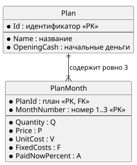

# Сохраняемые данные (ЛР2, уточнено в ЛР4)

Логическая модель: [er.puml](diagrams/er.puml), [er.svg](diagrams/er.svg).
Раздел «Схема SQLite» добавлен в ЛР4.

## Что сохраняется

Сохраняются только **исходные данные** плана — то, что вводит пользователь.
Прогноз (выручка, прибыль, деньги, задолженность, итоги) не хранится: он каждый раз
пересчитывается из исходных данных (П-Ф6). Так после открытия результат гарантированно
совпадает с расчётом по текущим формулам и не бывает «устаревших» сохранённых чисел.

## Сущность «План» (Plan)

| Поле | Смысл | Ключ / ограничение |
| --- | --- | --- |
| Id | Постоянный идентификатор плана (Guid) | Первичный ключ |
| Name | Название | Обязательное, не пустое |
| OpeningCash | Деньги до первого месяца | Обязательное, ≥ 0, до копейки |

## Сущность «Месяц плана» (PlanMonth)

| Поле | Смысл | Ключ / ограничение |
| --- | --- | --- |
| PlanId | К какому плану относится | Внешний ключ → Plan.Id; часть первичного ключа |
| MonthNumber | Номер месяца | 1, 2 или 3; часть первичного ключа |
| Quantity | Q, количество услуг | Целое, ≥ 0 |
| Price | P, цена услуги | ≥ 0, до копейки |
| UnitCost | V, переменные затраты на услугу | ≥ 0, до копейки |
| FixedCosts | F, постоянные расходы | ≥ 0, до копейки |
| PaidNowPercent | A, процент оплаты сразу | Целое от 0 до 100 |

## Связь и правило П-Б10

- Один план — ровно три месяца; месяц принадлежит ровно одному плану (связь 1 : 3).
- Первичный ключ месяца — пара (PlanId, MonthNumber). Поэтому в одном плане не может
  быть двух месяцев с одним номером.
- При удалении плана удаляются и его месяцы (месяцы без плана не имеют смысла).
- Сохранение с существующим Id заменяет название, начальные деньги и все три месяца,
  а не добавляет второй план (П-Ф4).

## Связь с классами

| Хранилище | Код |
| --- | --- |
| Plan (таблица Plans) | `FinancialPlan` (Id, Name, OpeningCash) |
| PlanMonth (таблица MonthPlans) | `MonthPlan` в `FinancialPlan.Months`; MonthNumber = позиция в списке + 1 |

## Схема SQLite (ЛР4)

Деньги хранятся **целым числом копеек** (`INTEGER`): 50 000,50 ₽ → 5 000 050.
Тип REAL (число с плавающей точкой) не используется — в нём копейки могут потеряться.
При чтении копейки делятся на 100 и снова становятся `decimal`.

### Таблица Plans

| Столбец | SQL-тип | Ограничения | Поле в коде |
| --- | --- | --- | --- |
| Id | TEXT | PRIMARY KEY | FinancialPlan.Id (Guid строкой) |
| Name | TEXT | NOT NULL, CHECK (length(trim(Name)) > 0) | FinancialPlan.Name |
| OpeningCashKopecks | INTEGER | NOT NULL, CHECK (≥ 0) | FinancialPlan.OpeningCash × 100 |

### Таблица MonthPlans

| Столбец | SQL-тип | Ограничения | Поле в коде |
| --- | --- | --- | --- |
| PlanId | TEXT | NOT NULL, FOREIGN KEY → Plans(Id) ON DELETE CASCADE | — |
| MonthNumber | INTEGER | NOT NULL, CHECK (1…3) | позиция в Months + 1 |
| Quantity | INTEGER | NOT NULL, CHECK (≥ 0) | MonthPlan.Quantity |
| PriceKopecks | INTEGER | NOT NULL, CHECK (≥ 0) | MonthPlan.Price × 100 |
| UnitCostKopecks | INTEGER | NOT NULL, CHECK (≥ 0) | MonthPlan.UnitCost × 100 |
| FixedCostsKopecks | INTEGER | NOT NULL, CHECK (≥ 0) | MonthPlan.FixedCosts × 100 |
| PaidNowPercent | INTEGER | NOT NULL, CHECK (0…100) | MonthPlan.PaidNowPercent |

Первичный ключ MonthPlans — **(PlanId, MonthNumber)**: в одном плане номер месяца уникален (П-Б10).

### Правила работы с базой

- Схема создаётся при первом запуске (`CREATE TABLE IF NOT EXISTS`), файл базы — `findirector.db`.
- Для каждого подключения выполняется `PRAGMA foreign_keys = ON` — без этого SQLite не проверяет внешние ключи.
- Сохранение — **одна транзакция**: вставить или обновить строку плана (`INSERT … ON CONFLICT(Id) DO UPDATE`),
  удалить старые месяцы плана, вставить три новых. Если что-то упало — откат, в базе остаётся прежняя версия.
- Тот же Id → обновление, второй план не появляется (П-Ф4).
- Недопустимый план сохранить нельзя: его не создаст конструктор `FinancialPlan` / `MonthPlan` (П-Ф5).
  CHECK-ограничения в базе — вторая линия защиты.
- При открытии план собирается через конструкторы Domain, поэтому повреждённые данные тоже будут отклонены.
