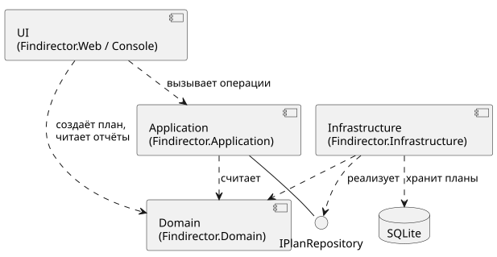
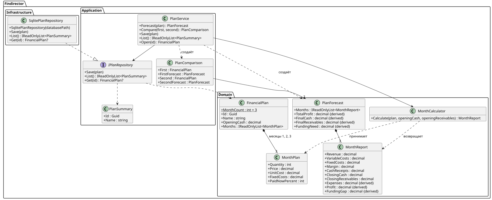

# ЛР2 — Проектирование системы

Документ описывает, из каких частей будет состоять приложение, какие операции оно выполняет
и как устроен расчёт трёх месяцев. Требования и примеры — в [requirements.md](requirements.md),
сохраняемые данные — в [data.md](data.md).

## 1. Части приложения (ЛР2-А1, ЛР2-А2)

| Часть | Проект | Что делает | От чего зависит |
| --- | --- | --- | --- |
| Domain | Findirector.Domain | План, параметры месяца, результаты, проверка ограничений и все финансовые формулы | Ни от чего (только .NET) |
| Application | Findirector.Application | Операции: прогноз, сравнение, сохранение, список, открытие. Порядок расчёта трёх месяцев. Интерфейс хранилища `IPlanRepository` | Domain |
| Infrastructure | Findirector.Infrastructure | Хранение планов в SQLite, реализует `IPlanRepository` (ЛР4) | Application, Domain |
| UI | Findirector.Web (Blazor, ЛР5); сейчас Findirector.Console | Ввод данных, кнопки, вывод таблиц и ошибок. Вызывает только операции Application | Application, Domain |

Domain ничего не знает об остальных частях. Application знает только Domain и сам объявляет,
какое хранилище ему нужно. Infrastructure подстраивается под интерфейс из Application, а не наоборот.
В точке запуска UI создаётся `SqlitePlanRepository` и передаётся в `PlanService`.

Диаграмма компонентов: [components.puml](diagrams/components.puml), [components.svg](diagrams/components.svg).

**Что уже реализовано (ЛР3).** Проект `Findirector.Application` создан. В Domain добавлены
`FinancialPlan` и `PlanForecast`, в Application — `PlanService.Forecast`, `PlanService.Compare`
и `PlanComparison`. Консоль вызывает только `PlanService` и форматирует вывод (ЛР3-А1).
`IPlanRepository`, `Save`, `List`, `Open` и `PlanSummary` появятся в ЛР4 вместе с SQLite:
пока хранить нечего, а интерфейс без реализации был бы лишним.

## 2. Классы (ЛР2-Д2)

Диаграмма классов: [domain.puml](diagrams/domain.puml), [domain.svg](diagrams/domain.svg).

**Domain**

- `FinancialPlan` — план: `Id` (Guid), `Name`, `OpeningCash`, `Months` (ровно три `MonthPlan`).
  Номер месяца — его позиция в списке: `Months[0]` — месяц 1, `Months[1]` — месяц 2, `Months[2]` — месяц 3.
  Так номера всегда 1, 2, 3 и не повторяются (П-Б10). Конструктор проверяет непустое название,
  `OpeningCash ≥ 0` до копейки и что месяцев ровно три (П-Б8, П-Б10).
- `MonthPlan` — параметры месяца из ЛР0 (Q, P, V, F, A). Уже проверяет П-Б8 в конструкторе.
- `MonthCalculator` — расчёт одного месяца из ЛР0 (формулы П-Б1–П-Б6).
- `MonthReport` — результат месяца из ЛР0.
- `PlanForecast` — прогноз плана: три `MonthReport` и итоги П-Б7
  (`TotalProfit`, `FinalCash`, `FinalReceivables`, `FundingNeed`). Итоги вычисляются из месячных отчётов.

**Application**

- `PlanService` — прикладные операции (контракты ниже).
- `PlanComparison` — результат сравнения: два плана и их прогнозы.
- `PlanSummary` — строка списка планов: `Id`, `Name`.
- `IPlanRepository` — интерфейс хранилища: `Save`, `List`, `Get`.

## 3. Контракты операций (ЛР2-Д3)

Все операции — методы `PlanService`. Деньги — `decimal`, рубли с копейками.

### 3.1. Прогноз — `Forecast(FinancialPlan plan) : PlanForecast`

- **Вход:** план. Его параметры уже проверены конструкторами `FinancialPlan` и `MonthPlan`.
- **Порядок расчёта (перенос денег и задолженности):**
  1. `cash = plan.OpeningCash`, `receivables = 0` (до первого месяца долга нет, П-Б4).
  2. Для месяцев 1, 2, 3 по очереди:
     `report = calculator.Calculate(month, cash, receivables)`;
     затем `cash = report.ClosingCash`, `receivables = report.ClosingReceivables` (П-Б5).
  3. Отрицательный `cash` не останавливает цикл и не заменяется кредитом (П-Б6).
  4. Из трёх отчётов создаётся `PlanForecast`.
- **Результат:** `PlanForecast` — три месячных отчёта и итоги:
  - `TotalProfit` = Profit1 + Profit2 + Profit3;
  - `FinalCash` = C3;
  - `FinalReceivables` = D3 (показывается отдельно, к деньгам не прибавляется);
  - `FundingNeed` = max(0, −min(C1, C2, C3)) — максимум дефицита, а не сумма (П-Б7).
- **Ошибки:** `plan = null` → `ArgumentNullException`.
- **Важно:** план не изменяется, каждый вызов считает с начала. Повторный вызов даёт тот же результат (П-Ф6).

### 3.2. Сравнение — `Compare(FinancialPlan first, FinancialPlan second) : PlanComparison`

- **Вход:** два плана.
- **Действие:** вызывает `Forecast` для каждого отдельно, планы друг на друга не влияют.
- **Результат:** `PlanComparison` с двумя прогнозами; UI показывает рядом `TotalProfit`,
  `FinalCash`, `FinalReceivables`, `FundingNeed` (П-Ф3).
- **Ошибки:** любой план `null` → `ArgumentNullException`.

### 3.3. Сохранение — `Save(FinancialPlan plan) : void`

- **Вход:** план.
- **Действие:** `repository.Save(plan)`. Если план с таким `Id` есть — он обновляется целиком,
  иначе создаётся новый (П-Ф4). Сохраняются только исходные данные, прогноз не сохраняется.
- **Результат:** план есть в хранилище.
- **Ошибки:** `null` → `ArgumentNullException`; ошибка хранилища пробрасывается дальше.
  Недопустимый план сохранить невозможно: его нельзя даже создать (см. 3.6).

### 3.4. Список — `List() : IReadOnlyList<PlanSummary>`

- **Вход:** нет.
- **Результат:** идентификаторы и названия всех сохранённых планов, отсортированные по названию.
  Пустой список, если планов нет.
- **Ошибки:** ошибка хранилища.

### 3.5. Открытие — `Open(Guid id) : FinancialPlan`

- **Вход:** идентификатор из списка.
- **Результат:** план с теми же значениями, что были сохранены (включая копейки).
  Его прогноз совпадает с прогнозом до сохранения.
- **Ошибки:** плана нет → `KeyNotFoundException` («План не найден»).

### 3.6. Ошибки ввода (П-Ф5)

Ограничения проверяют конструкторы Domain: `MonthPlan` (Q, P, V, F, A) и `FinancialPlan`
(название, начальные деньги, три месяца). Нарушение — `ArgumentException` или
`ArgumentOutOfRangeException`. В `ParamName` записано поле (например, `paidNowPercent`),
в `Message` — причина. UI ловит исключение и показывает, в каком поле и месяце ошибка.
Так план с ошибкой не попадает ни в расчёт, ни в сохранение.

## 4. Ручной расчёт по контракту (ЛР2-Т1)

Учебный сценарий: начальные деньги 50 000; в каждом месяце Q = 5, P = 30 000, V = 10 000,
F = 70 000, **A = 50%**.

Шаг 1: `cash = 50 000`, `receivables = 0`.

| Месяц | Начало: cash / receivables | R = Q·P | E = Q·V + F | S = R·A/100 | Поступления = receivables + S | C = cash + поступления − E | D = R − S | Прибыль = R − E |
| --- | --- | ---: | ---: | ---: | ---: | ---: | ---: | ---: |
| 1 | 50 000 / 0 | 150 000 | 120 000 | 75 000 | 75 000 | 5 000 | 75 000 | 30 000 |
| 2 | 5 000 / 75 000 | 150 000 | 120 000 | 75 000 | 150 000 | 35 000 | 75 000 | 30 000 |
| 3 | 35 000 / 75 000 | 150 000 | 120 000 | 75 000 | 150 000 | 65 000 | 75 000 | 30 000 |

Итоги: `TotalProfit` = 30 000 · 3 = 90 000; `FinalCash` = 65 000; `FinalReceivables` = 75 000;
`FundingNeed` = max(0, −min(5 000; 35 000; 65 000)) = max(0, −5 000) = 0.

Сравнение с постановкой: деньги 5 000 / 35 000 / 65 000, поступления 75 000 / 150 000 / 150 000,
прибыль 90 000, задолженность 75 000, дополнительные деньги 0 — **совпадает**.

## 5. Обоснование решений (ЛР2-Д4)

### 5.1. Расчёт отделён от UI — SRP

SRP (принцип единственной ответственности): у класса должна быть одна причина для изменения.

- Формулы меняются, когда меняются финансовые правила П-Б. Это только Domain.
- Экран меняется, когда меняется внешний вид или способ ввода. Это только UI.

Если формулы писать прямо в Blazor-компонентах, то при смене дизайна можно случайно сломать
расчёт, а одну и ту же формулу пришлось бы повторять в консоли, на экране и в тестах.
Сейчас расчёт проверяется тестами без запуска интерфейса, а консоль из ЛР0 и будущий Blazor
используют один и тот же `PlanService`. В ЛР0 так уже сделано: `Program.cs` только вызывает
`MonthCalculator` и печатает результат.

### 5.2. Хранилище подключено через интерфейс — DIP

DIP (принцип инверсии зависимостей): модули верхнего уровня не должны зависеть от модулей
нижнего уровня, оба зависят от абстракции.

- `PlanService` (верхний уровень, Application) работает с `IPlanRepository`, а не с SQLite.
- `SqlitePlanRepository` (нижний уровень, Infrastructure) реализует этот интерфейс.
- Интерфейс объявлен в Application, поэтому стрелка зависимости идёт от Infrastructure к Application.

Что это даёт: Application и Domain собираются и тестируются без базы данных
(в тестах можно подставить простое хранилище в памяти); SQLite можно заменить на другую базу,
не трогая расчёт; в ЛР4 изменятся только Infrastructure и точка запуска.

Интерфейс сделан только для хранилища: у него действительно может быть несколько реализаций.
Для калькулятора и сервиса интерфейсы не нужны.
