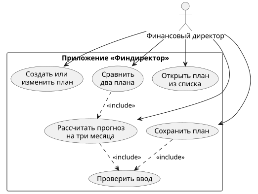

# ЛР1 — Требования к приложению «Финдиректор: прибыль и деньги»

## 1. Цель

Приложение помогает финансовому директору студии сайтов понять, хватит ли компании денег
на три месяца вперёд, даже если по плану она получает прибыль. Пользователь задаёт начальные
деньги и параметры трёх месяцев, получает прогноз и сравнивает два варианта плана
(например, с разной долей оплаты сразу).

Главный вопрос: **прибыль есть, а денег хватает?** Прибыль считается по выполненным услугам,
а деньги — по реальным поступлениям, поэтому эти числа могут сильно отличаться.

## 2. Границы модели

Входит в модель:

- одна компания, одна типовая услуга, расчёт в рублях;
- ровно три месяца плана (1, 2, 3);
- все продажи выполняются в своём месяце, все затраты признаются и оплачиваются в том же месяце;
- клиент платит долю A сразу, остаток — в следующем месяце (П-Б3, П-Б4);
- сохранение планов и сравнение двух планов.

Не входит в модель:

- налоги, склад, амортизация, кредиты и автоматическое заимствование (П-Б6);
- порядок платежей внутри месяца;
- четвёртый месяц: неоплаченная выручка третьего месяца остаётся задолженностью;
- регистрация пользователей и несколько компаний.

## 3. Словарь

| Термин | Определение | Правило |
| --- | --- | --- |
| Выручка (R) | Стоимость выполненных за месяц услуг: R = Q × P. Считается независимо от того, заплатил клиент или нет | П-Б1 |
| Маржинальный доход | Выручка минус переменные затраты: R − Q × V | П-Б1 |
| Расходы (E) | Переменные и постоянные затраты месяца: E = Q × V + F | П-Б2 |
| Прибыль | Выручка минус расходы: R − E. Отрицательная прибыль — убыток | П-Б2 |
| Поступления | Деньги, которые реально пришли от клиентов за месяц: оплата текущих продаж S + долг клиентов на начало месяца | П-Б3, П-Б4 |
| Дебиторская задолженность (D) | Выручка, которую клиенты ещё не оплатили: D = R − S. Приходит в следующем месяце | П-Б3 |
| Деньги на конец месяца (C) | C = деньги на начало + поступления − E | П-Б5 |
| Кассовый разрыв | Ситуация, когда прогнозные деньги C < 0: компании не хватает денег, чтобы оплатить расходы, хотя прибыль может быть. При C = 0 разрыва нет | П-Б6 |
| Потребность в финансировании | Сколько денег нужно добавить на старте, чтобы ни в одном месяце не было минуса: max(0, −min(C1, C2, C3)) | П-Б7 |

## 4. Объекты

**План** — то, что пользователь создаёт, сохраняет и открывает.

| Поле | Описание | Ограничение |
| --- | --- | --- |
| Идентификатор | Постоянный, не меняется при редактировании | П-Б10 |
| Название | Имя плана | Не пустое (П-Б10) |
| Начальные деньги | Деньги до первого месяца | ≥ 0, до копейки (П-Б8) |
| Месяцы | Параметры месяцев | Ровно три, номера 1, 2, 3 без повторов (П-Б10) |

**Параметры месяца** — входные данные одного месяца.

| Поле | Описание | Ограничение (П-Б8) |
| --- | --- | --- |
| Номер | 1, 2 или 3 | Уникален в плане |
| Q — количество услуг | Сколько услуг выполнено и продано | Целое, ≥ 0 |
| P — цена | Цена одной услуги | ≥ 0, до копейки |
| V — переменные затраты | Затраты на одну услугу | ≥ 0, до копейки; P < V допустимо |
| F — постоянные расходы | Аренда, оклады и т. п. за месяц | ≥ 0, до копейки |
| A — оплата сразу | Процент выручки, который клиент платит в этом же месяце | Целое от 0 до 100 |

**Результат (прогноз)** — не вводится и не хранится, а каждый раз считается заново из плана (П-Ф6).

- По каждому месяцу: выручка, маржинальный доход, расходы, прибыль, поступления, деньги на конец (C), задолженность на конец (D) (П-Ф2).
- Итоги: прибыль за три месяца, деньги на конец третьего месяца C3, задолженность D3 отдельно от денег, потребность в финансировании (П-Б7).

## 5. Сценарии

### С1. Расчёт созданного или изменённого плана

- **Ввод:** название, начальные деньги, параметры трёх месяцев (Q, P, V, F, A).
- **Действие:** пользователь нажимает «Рассчитать». Приложение проверяет ввод (П-Б8, П-Б10), затем считает месяцы по порядку: месяц 1 начинается с начальных денег и нулевой задолженности, следующий месяц начинается с C и D предыдущего (П-Б5).
- **Результат:** таблица трёх месяцев и итоги (П-Ф2, П-Б7). Если план изменили, старый прогноз скрывается до нового нажатия «Рассчитать»; новый расчёт идёт с исходных данных, а не продолжает старый (П-Ф6).
- **Отказ:** при недопустимом вводе показывается поле и причина ошибки, расчёт не выполняется (П-Ф5).

### С2. Сравнение двух планов

- **Ввод:** два выбранных плана.
- **Действие:** приложение рассчитывает каждый план отдельно по С1 и ставит итоги рядом.
- **Результат:** для каждого плана — прибыль за три месяца, деньги C3, задолженность D3, потребность в финансировании (П-Ф3). Исходные данные планов не меняются.
- **Отказ:** если один из планов недопустим — ошибка с указанием плана и поля, сравнение не показывается (П-Ф5). Если после сравнения план изменили — сравнение скрывается до пересчёта (П-Ф6).

### С3. Сохранение и открытие плана

- **Ввод:** план (для сохранения) или выбор плана из списка (для открытия).
- **Действие:** «Сохранить» записывает исходные данные плана. Если план с таким идентификатором уже есть, он обновляется, а не создаётся второй (П-Ф4). «Открыть» показывает список сохранённых планов и загружает выбранный.
- **Результат:** после перезапуска приложения план есть в списке, открывается с теми же значениями (включая копейки), и его расчёт даёт те же числа, что до сохранения.
- **Отказ:** недопустимый план не сохраняется, показывается поле и причина (П-Ф5). Если выбранного плана нет в хранилище — сообщение «План не найден».

## 6. Диаграмма вариантов использования

Исходник: [use-cases.puml](diagrams/use-cases.puml), изображение: [use-cases.svg](diagrams/use-cases.svg).

## 7. Приёмочные примеры

Ожидаемые числа посчитаны вручную до реализации.

**Контрольный план** (из постановки): начальные деньги 50 000 ₽; в каждом месяце Q = 5, P = 30 000 ₽,
V = 10 000 ₽, F = 70 000 ₽. Тогда в любом месяце: R = 150 000, переменные затраты = 50 000,
маржинальный доход = 100 000, E = 120 000, прибыль = 30 000. Меняется только A.

### П1. Оплата 0% (всё через месяц)

Ввод: контрольный план, A = 0 во всех месяцах.

| Месяц | Деньги на начало | S | Поступления | E | C | D |
| --- | ---: | ---: | ---: | ---: | ---: | ---: |
| 1 | 50 000 | 0 | 0 | 120 000 | −70 000 | 150 000 |
| 2 | −70 000 | 0 | 150 000 | 120 000 | −40 000 | 150 000 |
| 3 | −40 000 | 0 | 150 000 | 120 000 | −10 000 | 150 000 |

Итоги: прибыль 90 000; C3 = −10 000; D3 = 150 000; потребность в финансировании = max(0, −(−70 000)) = 70 000.
Прогноз не останавливается на минусе (П-Б6). Проверяет: П-Ф1, П-Ф2, П-Б1–П-Б7.

### П2. Оплата 50% (половина сразу)

Ввод: контрольный план, A = 50 во всех месяцах.

| Месяц | Деньги на начало | S | Поступления | E | C | D |
| --- | ---: | ---: | ---: | ---: | ---: | ---: |
| 1 | 50 000 | 75 000 | 75 000 | 120 000 | 5 000 | 75 000 |
| 2 | 5 000 | 75 000 | 150 000 | 120 000 | 35 000 | 75 000 |
| 3 | 35 000 | 75 000 | 150 000 | 120 000 | 65 000 | 75 000 |

Итоги: прибыль 90 000; C3 = 65 000; D3 = 75 000; потребность в финансировании 0.
Проверяет: П-Ф1, П-Ф2, П-Б3–П-Б5, П-Б7.

### П3. Изменение плана П2 на 100% и пересчёт

Ввод: план П2 после расчёта; пользователь меняет A на 100 во всех месяцах.
Ожидание сразу после правки: прежний прогноз скрыт (П-Ф6). После «Рассчитать»:

| Месяц | Деньги на начало | S | Поступления | E | C | D |
| --- | ---: | ---: | ---: | ---: | ---: | ---: |
| 1 | 50 000 | 150 000 | 150 000 | 120 000 | 80 000 | 0 |
| 2 | 80 000 | 150 000 | 150 000 | 120 000 | 110 000 | 0 |
| 3 | 110 000 | 150 000 | 150 000 | 120 000 | 140 000 | 0 |

Итоги: прибыль 90 000; C3 = 140 000; D3 = 0; потребность 0. Расчёт начат с начальных 50 000,
а не с результата П2. Проверяет: П-Ф1, П-Ф2, П-Ф6, П-Б7.

### П4. Нет продаж

Ввод: начальные деньги 50 000; во всех месяцах Q = 0, P = 30 000, V = 10 000, F = 70 000, A = 50.

| Месяц | R | Маржинальный доход | E | Прибыль | Поступления | C | D |
| --- | ---: | ---: | ---: | ---: | ---: | ---: | ---: |
| 1 | 0 | 0 | 70 000 | −70 000 | 0 | −20 000 | 0 |
| 2 | 0 | 0 | 70 000 | −70 000 | 0 | −90 000 | 0 |
| 3 | 0 | 0 | 70 000 | −70 000 | 0 | −160 000 | 0 |

Итоги: прибыль −210 000 (убыток); C3 = −160 000; D3 = 0; потребность = 160 000.
Постоянные расходы платятся даже без продаж. Проверяет: П-Ф2, П-Б2, П-Б6, П-Б7.

### П5. Нулевые конечные деньги

Ввод: контрольный план, A = 0, но начальные деньги 120 000.

| Месяц | Деньги на начало | Поступления | E | C | D |
| --- | ---: | ---: | ---: | ---: | ---: |
| 1 | 120 000 | 0 | 120 000 | 0 | 150 000 |
| 2 | 0 | 150 000 | 120 000 | 30 000 | 150 000 |
| 3 | 30 000 | 150 000 | 120 000 | 60 000 | 150 000 |

Итоги: прибыль 90 000; C3 = 60 000; D3 = 150 000; потребность = max(0, −0) = 0.
При C = 0 дефицита нет. Проверяет: П-Б6, П-Б7.

### П6. Недопустимый процент оплаты

Ввод: контрольный план, A = 50 в месяцах 1 и 3, **A = 120 в месяце 2**.
Ожидание: ошибка «Месяц 2, оплата в текущем месяце: процент должен быть от 0 до 100».
Прогноз не строится, при попытке сохранить план не сохраняется.
Проверяет: П-Ф5, П-Б8.

### П7. Сравнение двух планов

Ввод: план «Всё через месяц» (П1) и план «Половина сразу» (П2).

| Показатель | Всё через месяц (A = 0%) | Половина сразу (A = 50%) |
| --- | ---: | ---: |
| Прибыль за 3 месяца | 90 000 | 90 000 |
| Деньги C3 | −10 000 | 65 000 |
| Задолженность D3 | 150 000 | 75 000 |
| Потребность в финансировании | 70 000 | 0 |

Прибыль одинаковая, а деньги разные — в этом смысл сравнения. После сравнения параметры обоих
планов не изменились. Проверяет: П-Ф3, П-Б7.

### П8. Сохранение и открытие

Ввод: план «Половина сразу» (П2) с идентификатором, начальные деньги 50 000,50 ₽ (с копейками).

1. Сохранить план. В списке появился один план «Половина сразу».
2. Перезапустить приложение, открыть план из списка. Все значения совпадают, начальные деньги — 50 000,50.
3. Рассчитать: C1 = 5 000,50; C2 = 35 000,50; C3 = 65 000,50; D3 = 75 000; потребность 0 (числа П2 + 0,50).
4. Изменить A на 100 и сохранить снова. В списке всё ещё один план, при открытии A = 100.

Проверяет: П-Ф4, П-Ф1, П-Ф6.

## 8. Таблица соответствия

| Функция | Что требует | Сценарий | Примеры |
| --- | --- | --- | --- |
| П-Ф1 | Создание и редактирование плана | С1 | П1, П2, П3, П8 |
| П-Ф2 | Месячные показатели и итоги | С1 | П1, П2, П3, П4, П5 |
| П-Ф3 | Сравнение двух планов | С2 | П7 |
| П-Ф4 | Сохранение, список, открытие, обновление по идентификатору | С3 | П8 |
| П-Ф5 | Ошибка с полем и причиной, без расчёта и сохранения | С1, С2, С3 | П6 |
| П-Ф6 | Пересчёт с исходных данных, скрытие старого результата | С1, С2 | П3, П8 |
